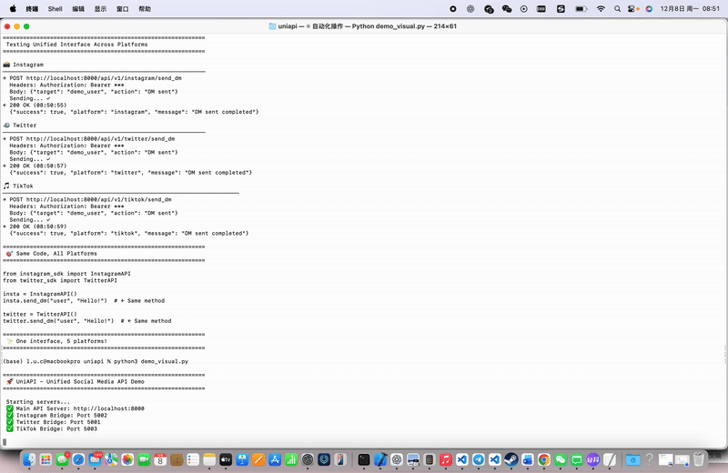

# UniAPI - Universal Social Media API Platform

<div align="center">

**Official API-style unified interface for multi-platform social media**

[](https://opensource.org/licenses/MIT)
[](https://www.python.org/downloads/)
[](https://fastapi.tiangolo.com/)
[](https://playwright.dev/)
[](https://github.com/LiuLucian/uniapi/stargazers)
[](https://github.com/LiuLucian/uniapi/network/members)
[](https://github.com/LiuLucian/uniapi/issues)
[](https://github.com/LiuLucian/uniapi/commits/main)

---


<p align="center"><i>✨ One interface, 5 platforms - that's it.</i></p>

</div>

## 🎯 Why UniAPI?

| Feature | Official APIs | UniAPI |
|---------|--------------|--------|
| **Approval** | Days/Weeks waiting | ✅ Instant - use immediately |
| **Cost** | $$$-$$$$$ monthly | ✅ Free & Open Source |
| **Rate Limits** | Strict (often 100-500/day) | ✅ Flexible |
| **Feature Access** | Limited by API | ✅ Full platform features |
| **Multi-platform Code** | 5 different APIs to learn | ✅ 1 unified interface |
| **Setup Time** | Hours of reading docs | ✅ 5 minutes |
| **Breaking Changes** | Frequent API deprecations | ✅ Stable interface |

## ✨ Features

- 🎯 **Unified Interface**: All platforms use the same API interface with minimal learning curve
- 🚀 **Official-style Design**: API design mimics official APIs for simplicity and elegance
- 🔐 **Cookie Authentication**: Browser cookie-based auth, no developer approval needed
- 🤖 **Browser Automation**: Uses Playwright to bypass API limitations
- 📦 **One-Click Deployment**: Automated installation and startup scripts
- 🌐 **Multi-Platform Support**: Twitter, Instagram, TikTok, Facebook, LinkedIn

## 🚀 Supported Platforms

| Platform | Bridge Server | SDK | Status |
|----------|--------------|-----|--------|
| **Twitter** | Port 5001 | `twitter_sdk.py` | ✅ 100% |
| **Instagram** | Port 5002 | `instagram_sdk.py` | ✅ 100% |
| **TikTok** | Port 5003 | `tiktok_sdk.py` | ✅ 100% |
| **Facebook** | Port 5004 | `facebook_sdk.py` | ✅ 100% |
| **LinkedIn** | Port 5005 | `linkedin_sdk.py` | ✅ 100% |

## 💼 Use Cases

Perfect for:

- 📈 **Marketing Automation** - Schedule and distribute content across all platforms
- 🔍 **Lead Generation** - Auto-reply to comments containing specific keywords
- 📊 **Social Listening** - Monitor brand mentions and competitor activity
- 🤖 **Chatbot Development** - Build automated response systems
- 📱 **Content Distribution** - Publish once, reach 5 platforms instantly
- 🎯 **Agency Tools** - Manage multiple client accounts from one interface
- 🔬 **Research Projects** - Collect social media data for analysis
- 🎓 **Educational Projects** - Learn API design and browser automation

**Real-world example:**
```python
# Monitor competitor posts and auto-respond to their followers
from instagram_sdk import InstagramAPI

api = InstagramAPI()
competitors = ["competitor1", "competitor2"]

for competitor in competitors:
    posts = api.get_user_posts(competitor, limit=5)
    for post in posts:
        comments = api.get_post_comments(post.url)
        for comment in comments:
            # Engage with their audience
            api.send_dm(comment.username, "Check out our product!")
```

## 🏗️ Architecture

```
User Code
   ↓
Python SDK (instagram_sdk.py, tiktok_sdk.py, etc.)
   ↓
FastAPI Main Server (Port 8000)
   ↓
Bridge Servers (Ports 5001-5005)
   ↓
Playwright Browser Automation
   ↓
Social Media Platforms
```

## 📦 Quick Start

### 1️⃣ Clone the Project

```bash
git clone https://github.com/LiuLucian/uniapi.git
cd uniapi
```

### 2️⃣ One-Click Installation

```bash
cd backend
./install.sh
```

This will automatically install:
- Python dependencies (FastAPI, Playwright, etc.)
- Playwright browser drivers
- Create necessary directories and configuration files

### 3️⃣ Configure Authentication

Edit `backend/platforms_auth.json` and add your platform cookies:

```json
{
  "instagram": {
    "cookies": {
      "sessionid": "your_instagram_sessionid"
    }
  },
  "twitter": {
    "cookies": {
      "auth_token": "your_twitter_auth_token",
      "ct0": "your_twitter_ct0"
    }
  }
  // ... other platforms
}
```

> 💡 How to get cookies? See [QUICK_START.md](QUICK_START.md)

### 4️⃣ Start Services

```bash
cd backend
./start_uniapi.sh
```

After startup, automatic health checks will run. All ✅ marks indicate success.

### 5️⃣ Use the API

#### Method 1: Python SDK (Recommended)

```python
from instagram_sdk import InstagramAPI
from tiktok_sdk import TikTokAPI

# Instagram example
insta = InstagramAPI()
user = insta.get_user("instagram")
print(f"Username: {user['username']}, Followers: {user['followers']}")

insta.like_post("https://www.instagram.com/p/ABC123/")
insta.send_dm("username", "Hello from UniAPI!")

# TikTok example
tiktok = TikTokAPI()
user = tiktok.get_user("@username")
tiktok.like_video("https://www.tiktok.com/@user/video/123")
```

#### Method 2: Direct REST API

```bash
# View API documentation
open http://localhost:8000/api/docs

# Test with curl
curl http://localhost:8000/api/v1/instagram/users/instagram

# Like a post
curl -X POST http://localhost:8000/api/v1/instagram/posts/like \
  -H "Content-Type: application/json" \
  -d '{"post_url": "https://www.instagram.com/p/ABC123/"}'
```

## 🏗️ Unified API Interface

All platform SDKs follow the **same interface design**:

```python
# User operations
api.get_user(username)              # Get user info
api.follow_user(username)           # Follow user

# Content operations
api.like_post(url)                  # Like/favorite
api.comment(url, text)              # Comment
api.send_dm(username, message)      # Send DM

# Batch operations
api.batch_like(urls, delay=5)       # Batch like with auto-delay
```

## 🛠️ Management Commands

```bash
# Start all services
cd backend && ./start_uniapi.sh

# Stop all services
cd backend && ./stop_uniapi.sh

# View logs
tail -f backend/logs/fastapi.log
tail -f backend/logs/instagram_bridge.log

# Check service status
curl http://localhost:8000/health
curl http://localhost:5002/health  # Instagram bridge
```

## 📁 Project Structure

```
uniapi/
├── backend/
│   ├── main.py                 # FastAPI main server
│   ├── platforms/              # Platform bridge servers
│   │   ├── twitter/
│   │   ├── instagram/
│   │   ├── tiktok/
│   │   ├── facebook/
│   │   └── linkedin/
│   ├── api/v1/                 # FastAPI routes
│   ├── core/                   # Core configuration
│   ├── start_uniapi.sh         # Startup script
│   ├── stop_uniapi.sh          # Stop script
│   └── install.sh              # Installation script
├── instagram_sdk.py            # Instagram Python SDK
├── tiktok_sdk.py               # TikTok Python SDK
├── facebook_sdk.py             # Facebook Python SDK
├── linkedin_sdk.py             # LinkedIn Python SDK
├── twitter_sdk.py              # Twitter Python SDK
├── demo.py                     # Example code
├── QUICK_START.md              # Quick start guide
└── README.md                   # This file
```

## 🔧 Tech Stack

- **FastAPI** - High-performance Python web framework
- **Playwright** - Cross-browser automation tool
- **Flask** - Bridge server framework
- **Pydantic** - Data validation and type hints
- **Httpx** - Async HTTP client

## 📝 FAQ

### Q: Why not use official APIs directly?

A: Most social media platforms' official APIs:
- Require developer approval (complex review process)
- Have limited functionality (e.g., Instagram doesn't support DM API)
- Have strict rate limits
- Require payment (e.g., LinkedIn API)

UniAPI bypasses these limitations through browser automation, providing a more flexible solution.

### Q: Do cookies expire?

A: Yes. Cookie validity is typically 30-90 days. After expiration, you need to log in again and update `platforms_auth.json`.

### Q: Does this violate platform rules?

A: Automated operations may violate platform terms of service. Please use only for personal learning and testing, not for commercial purposes or large-scale operations.

### Q: How to avoid detection?

A:
- Use `auto_delay=True` to enable random delays
- Don't operate too frequently (recommended 5-10 seconds between operations)
- Use dedicated accounts, not your main account

## 📄 License

This project is open-sourced under the [MIT License](LICENSE).

## 🤝 Contributing

Contributions are welcome! See [CONTRIBUTING.md](CONTRIBUTING.md) for guidelines.

- 🐛 Found a bug? [Open an issue](https://github.com/LiuLucian/uniapi/issues/new)
- 💡 Have an idea? [Start a discussion](https://github.com/LiuLucian/uniapi/discussions)
- 🔧 Want to contribute code? Check out [good first issues](https://github.com/LiuLucian/uniapi/labels/good%20first%20issue)

## 🗺️ Roadmap

### ✅ Completed (v1.0)
- [x] Unified API for 5 platforms (Instagram, Twitter, TikTok, Facebook, LinkedIn)
- [x] FastAPI main server with Swagger docs
- [x] Browser automation with Playwright
- [x] Cookie-based authentication
- [x] One-click installation and startup

### 🚧 In Progress (v1.1 - Q1 2025)
- [ ] Webhook support for real-time events
- [ ] Scheduled posting with cron-like syntax
- [ ] Rate limiting and retry mechanisms
- [ ] Enhanced error logging

### 🔮 Planned (v2.0 - Q2 2025)
- [ ] Analytics dashboard (engagement metrics across platforms)
- [ ] Multi-account management per platform
- [ ] AI-powered content generation (GPT integration)
- [ ] Advanced search and filtering
- [ ] Export data to CSV/JSON

### 💡 Under Consideration
- [ ] YouTube support
- [ ] Reddit integration
- [ ] WhatsApp Business API
- [ ] Discord webhook support
- [ ] Telegram bot API

**Vote for features:** [Open a discussion](https://github.com/LiuLucian/uniapi/discussions) to suggest or vote on features!

## ⭐ Star History

[](https://star-history.com/#LiuLucian/uniapi&Date)

**Help us grow!** Star the repo if you find it useful 🌟

## ⚠️ Disclaimer

This project is for educational purposes only. Users are responsible for any consequences of using this project. The author assumes no liability.

---

<div align="center">

**Built something cool with UniAPI?** Add this badge to your project:

[](https://github.com/LiuLucian/uniapi)

```markdown
[](https://github.com/LiuLucian/uniapi)
```

</div>
